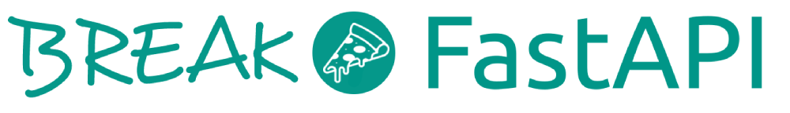

# BreakFastApi 🍣 🍔 🍕



**The most delicious API on the web.** Just send a request and you'll receive the most mouth watering dish recipe with estimated cooking time and all the necessary ingredients and instructions.

### **Problem:**

Humans are only capable of remembering a limited number of food recipes.

### **Solution:**

Break Fast Api solves this problem by memorizing more than 12.000 recipes and making them available at will.
The delicious meals are now only one GET request away from you.

---

### **Check it out!**

[](https://breakfastapi.fun/)

### **How does it work?**

---
For detailed instructions on installation and documentation please check the wiki page:

[](https://github.com/MariiaSizova/breakfastapi/wiki)

**Sample request:**


```python
import requests
r = requests.get("https://breakfastapi.fun/")
data = r.json()
```

**Sample response:**

```json
{
    "status": 200,
    "recipe": {
        "id": 11574,
        "name": "Devils Steak Sauce Recipe",
        "total_duration": 15,
        "ingredients": ["brown sugar",
                        "tomato sauce",
                        "raspberry",
                        "worcestershire sauce",
                        "hot pepper",
                        "black pepper",
                        "vinegar"
                        ],
        "directions": "In a saucepan over high heat, blend raspberry jam..."
    }
}
```
### **Projects using the BreakFastApi**
[](https://github.com/MarcLab1/BreakfastAPI)

[](https://gist.github.com/nonimportant/cb71f07fa17430d0751b949dc91ea569)

[](https://github.com/refekt/Bot-Frost/blob/master/commands/text.py#L588)

[](https://gist.github.com/nonimportant/4c94795b88c4dce32cf5407b909de389)

[](https://github.com/nonimportant/BreakFast-Application)

### Bon Appétit! │ Hyvää Ruokahalua! 😋
